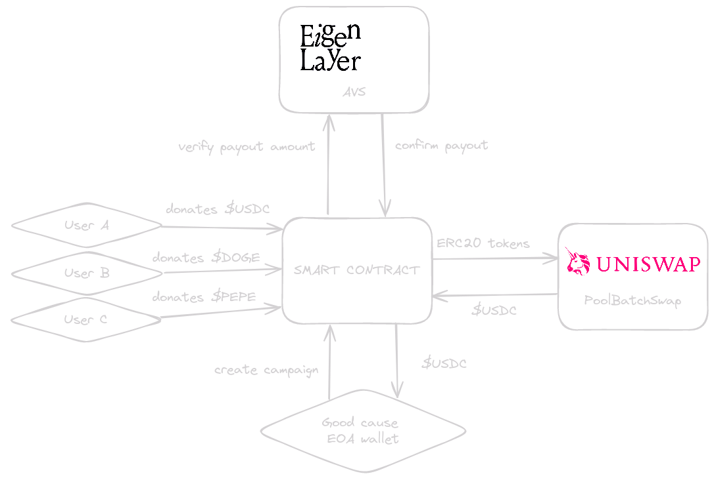

# 🫶 Donation Appreciation

<h4 align="center">
  
   
   
  <a href="https://devfolio.co/projects/donation-appreciation-cf9b">Devfolio</a> |
  <a href="https://donationappreciation.vercel.app/">Website</a>
</h4>

Donation Appreciation is a donation dApp that accepts shitcoins (all ERC20 tokens). A donation campaign is registered in the smart contract, and it determines a runtime and $USDC target for the donation. When the donation hits the target value (in $USDC), UniSwap is used to swap all tokens for $USDC, before transferring the $USDC to the donation recipient address. To check if the donation ERC20 holdings are greater than the donation target before swapping, we created an EigenLayer AVS that verifies this.

⚙️ Built using EigenLayer, The Graph, Uniswap NextJS, Hardhat, and Wagmi.

- 🗳️ **Quickly create a donation campaign**: On our frontend it's easy to setup a new campaign, just define a a campaign name, set a target (in $USDC) and you're ready to go.
- 🪝 **New Uniswap hooks**: TODO
- 🪙 **Accept all ERC20**: Donations can accept any ERC20 tokens, which will be swapped to $USDC at the end of the campaign.
- 📈 **Multiple ways to hit target**: Reach your donation targets either by new donations or by increase in token price of current donations.
- 🔐 **Secured with Eigenlayer AVS**: We use a custom EigenLayer AVS to verify the target is reached before swapping all ERC20 tokens to $USDC.

## Diagram

## Screenshots

| Landing Page                                   | Create Campaign                          |
| ---------------------------------------------- | ---------------------------------------- |
|  |  |

| Campaigns Overview                            | Campaign details                            |
| --------------------------------------------- | ------------------------------------------- |
|  |  |

## Hackathon tracks

###

### Uniswap Foundation - Track 3: Pool Operators & Research

We customized the PoolSwapTest.sol to create the PoolBatchSwapTest contract, enabling efficient batch token swaps using the IPoolManager interface. This contract processes multiple swap parameters in a single transaction, making the process more gas-efficient. This solution is not only useful for our platform, but also showcases the novel applications of batch swapping that are possible on Uniswap. We deployed and verified the contract on Sepolia testnet, and included a testfile in a seperate repo (using Foundry).

- [PoolBatchSwapTest Contract on Sepolia](https://sepolia.etherscan.io/address/0x3f1e9D9cfdB1b44feD1769C02C6AE5Bb97aF7E34#code)
- [Forked Uniswap v4-template with tests for PoolBatchSwapTest ](https://github.com/prahahackers24/uniswap-v4-tests/blob/main/script/03_BatchSwap.s.sol)

### Eigenlayer - Best use of EigenLayer AVS

We created our own Eigenlayer AVS to verify the total value of the donated ERC20 in a single campaign are at least equal to the campaign target in $USDC. When the EigenLayer stakers verify this, the campaign can close, swap all tokens to the target value in $USDC. When the swap is completed but the value turns out to be lower than the campaign target, validators get slashed. It's easy to verify, so the bonding period to withdraw can be very short in our case.

Also we fixed a bug in the Hello World repo, which caused issues when executing the make commands. After the hackathon we will submit a PR to the repo for this. Also we added 1 additional step in the readme, to help people get started more easily.

- [Github AVS repo](https://github.com/prahahackers24/AVS-PRAGUE)
- [Bugfix](https://github.com/prahahackers24/AVS-PRAGUE/blob/fe4c2c893bbc27046006a4c1b04e01d217dad29b/Makefile#L48-L52)
- [Readme update](https://github.com/prahahackers24/AVS-PRAGUE/blob/fe4c2c893bbc27046006a4c1b04e01d217dad29b/README.md?plain=1#L27)

### The Graph - Best New Subgraph

To query campaigns we created a subgraph that qustores eries newly created campaigns as Campaign entities. When donations are made or the campaign is closed, the Campaign entity is updated. We use the subgraph to query campaigns and show them on the overview page. Also we query individual campaigns to show the donation status and amounts on the campaign page.

- [The Graph Subgraph](https://api.studio.thegraph.com/query/72991/donation/version/latest)

### Linea - Build any dapp on Linea

Smart contract deployed and verified here:

- [DonationContract.sol on Linea Testnet](https://sepolia.lineascan.build/address/address/0xf97379b8768c2bb3CA23413766B1DB6840B551a0#code)
- [PoolBatchSwapTest.sol on Linea Testnet](https://sepolia.lineascan.build/address/address/0x5C0BDa6a6d287dFdC058b86bdaFc7509dB74E111#code)

### Mantle - Best DeFi project

We created a unique batch swap feature to make our donation dApp more gas efficient. This batch swap feature is a seperate smart contract, that can be used for many novel applications. Both our DonationContgract and PoolBatchSwapTeset are deployed on Mantle.

- [DonationContract.sol on Mantle Testnet](https://sepolia.mantlescan.xyz/address/0x77C461C1E180DD6A08A17E74bFb5207e44c7aC7f#code)
- [PoolBatchSwapTest.sol on Mantle Testnet](https://sepolia.mantlescan.xyz/address/0x7868c79421a36a00B0DF2c2C5254aBf89B98eA34#code)

### Mantle - Best UX/UI project

Our donation tool accepts any ERC20 token and multiple ones can be sent in one transaction. This not only saves gas, but is probably the only way to directly donate all the random memecoins or other tokens sitting in our wallets.

Creating a fundraising campaign is also a matter of a few clicks. Anyone can start accepting donations in any token, and eventually have them automatically converted to USDC.

### Optimism - Prototype a Superchain Superpower

The BatchSwap contract can leverage new usecases, such as the Donation Appreciation showcases. The BatchSwap is a gas efficient way to convert your portfolio to stables or ETH with one single transaction. We deployed our donation contract and batch swap contracts to Optimism.

- [DonationContract.sol on Optimism Sepolia](https://sepolia-optimism.etherscan.io/address/0x64CDeB6CD5ecfB002bdaFabc98B5C883C5C06B27#code)
- [PoolBatchSwapTest.sol on Optimism Sepolia](https://sepolia-optimism.etherscan.io/address/0xf97379b8768c2bb3CA23413766B1DB6840B551a0#code)

### Polygon - Launch a Creative MVP on Polygon Cardona

We created a unique donation platform that allows new ways of raising funds. The target can be reached by shilling the bags of the donation contract, making the donation campaign being able to hit their targets without additional donations. Deploying on the Cardona testnet was straight forward and easy, but we had trouble verifying the contracts.

- [DonationContract.sol on Polygon Cardona](https://cardona-zkevm.polygonscan.com/address/0x3B89a9D1026E29c7959154E5c826159C720007cb)
- [PoolBatchSwapTest.sol on Polygon Cardona](https://cardona-zkevm.polygonscan.com/address/0x64CDeB6CD5ecfB002bdaFabc98B5C883C5C06B27)

### Zircuit - Best Hackathon Project on Zircuit

Deploying in Zircuit was very easy, and also verification of the contracts was very straight forward. Only issue was the frontend intergration. On the Scaffold-ETH 2 starter repo we could integrate almost all chains using viem, but Zircuit isn't available yet. See the available chains [here](https://github.com/wevm/viem/tree/main/src/chains/definitions). We added it manually in our project, and will submit a PR to viem to make it available for future developers.

- [DonationContract.sol on Zircuit](https://explorer.zircuit.com/address/0x310256C0b02B1EF36A537427885E495533c13DeE#code)
- [PoolBatchSwapTest.sol on Zircuit](https://explorer.zircuit.com/address/0xA54f073Cc3fBAa3091dDAe16cDb5EB550c4a17A8#code)
- [Adding Zircuit to Frontend](https://github.com/prahahackers24/scaffold/commit/e6d200cef0c30143d6499c39f69efbe6377321ce)

## Links

- [Vercel deployment](https://donationappreciation.vercel.app/)
- [Devfolio project](https://devfolio.co/projects/donation-appreciation-cf9b)
- [Presentation slides](https://docs.google.com/presentation/d/1p5cFmmLIXDnmSeTd0cXsaEEOcuNP6fbQLGf-Eog11BU/edit?usp=sharing)
- [Demo video]()
- [Github dApp repo](https://github.com/prahahackers24/scaffold)
- [Github AVS repo](https://github.com/prahahackers24/AVS-PRAGUE)
- [The Graph Subgraph](https://api.studio.thegraph.com/query/72991/donation/version/latest)
- [DonationContract.sol on Sepolia](https://sepolia.etherscan.io/address/0x4095001d8d00c2c7f38b659173f9a2f2f1781a16)
- [PoolBatchSwapTest.sol on Sepolia](0x3f1e9D9cfdB1b44feD1769C02C6AE5Bb97aF7E34)

## Next steps

What can be improved?

- **Cross-chain campaigns -** Currently, each campaign lives on a single chain. We are investigating the possibility of making campaigns cross-chain. This means executing the swap function on each chain simultaneously. Is it possible to have an EigenLayer AVS that validates data across different chains?
- **Filter out potential malicious actors -** Use new AVS to filter donation creators (only accept legitimate fundraisers).
- **Optional filtering of accepted tokens -** Campaigns could be directed to a more specific community.

## Team

This project was build at EthPrague 2024 by:

- [AlexAstro](https://x.com/_alexastro/)
- [arjanjohan](https://x.com/arjanjohan/)
- [JacobJelen.eth](https://x.com/jacobjelen)
